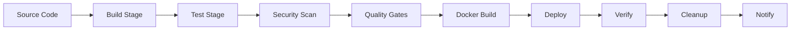

# CI/CD Pipeline Documentation

## Overview

This repository implements a comprehensive, modular CI/CD pipeline with advanced retry mechanisms, quality gates, and automated cleanup strategies.

## Pipeline Architecture



## Key Features

### 🔄 Progressive Retry System
- **Automatic retries**: Each stage has configurable retry logic with exponential backoff
- **Smart failure detection**: Identifies transient vs permanent failures
- **Retry attempts**: 3 attempts for build/test, 5 for deployment

### 📦 Artifact Management
- **Version 4 Actions**: Uses `actions/upload-artifact@v4` and `actions/download-artifact@v4`
- **Compression**: Level 9 compression for optimal storage
- **Retention**: Configurable retention periods (7-30 days)
- **Naming**: Descriptive naming with timestamps and build IDs

### 🧹 Comprehensive Cleanup
- **Workspace cleanup**: Removes temporary files and directories
- **Docker cleanup**: Prunes containers, images, volumes, and networks
- **GitHub cleanup**: Removes old artifacts and caches
- **AWS cleanup**: Optional cleanup of temporary AWS resources

### 🚦 Quality Gates
- **Code coverage**: Minimum 80% threshold
- **Linting**: Automated code quality checks
- **Security scanning**: SAST and dependency vulnerability scanning
- **Performance metrics**: Build time and bundle size monitoring

## Configuration

### Environment Variables

| Variable | Description | Default |
|----------|-------------|---------|
| `NODE_VERSION` | Node.js version | `16.x` |
| `AWS_REGION` | AWS deployment region | `us-east-1` |
| `ARTIFACT_RETENTION_DAYS` | Days to keep artifacts | `7` |
| `RETRY_ATTEMPTS` | Number of retry attempts | `3` |
| `RETRY_DELAY` | Delay between retries (seconds) | `5` |

### Secrets Required

- `AWS_ACCESS_KEY_ID`: AWS access key for deployments
- `AWS_SECRET_ACCESS_KEY`: AWS secret key for deployments
- `GITHUB_TOKEN`: Automatically provided by GitHub Actions

## Usage

### Manual Trigger

```bash
gh workflow run "CI/CD Main Pipeline" \
  --ref main \
  -f environment=production
```

### Branch Protection

Recommended branch protection rules:
- Require pull request reviews
- Require status checks to pass
- Require branches to be up to date
- Include administrators

## Monitoring

### Pipeline Metrics
- Build success rate
- Average build time
- Test coverage trends
- Deployment frequency
- Mean time to recovery (MTTR)

### Alerts
- Failed deployments
- Coverage drops below threshold
- Security vulnerabilities detected
- Build time exceeds limits

## Troubleshooting

### Common Issues

1. **Artifact Upload Failures**
   - Ensure using `actions/upload-artifact@v4`
   - Check file permissions
   - Verify path patterns

2. **Retry Mechanism Not Working**
   - Check retry configuration in stage
   - Verify error patterns match
   - Review timeout settings

3. **Cleanup Stage Failures**
   - Check permissions for resource deletion
   - Verify retention policies
   - Review cleanup logs

## Contributing

To modify the pipeline:

1. Create a feature branch
2. Make changes to pipeline files
3. Test in a non-production environment
4. Submit pull request with description
5. Wait for review and approval

## Support

For issues or questions:
- Create an issue in the repository
- Contact the DevOps team
- Check the pipeline logs in GitHub Actions

## License

MIT License - See LICENSE file for details